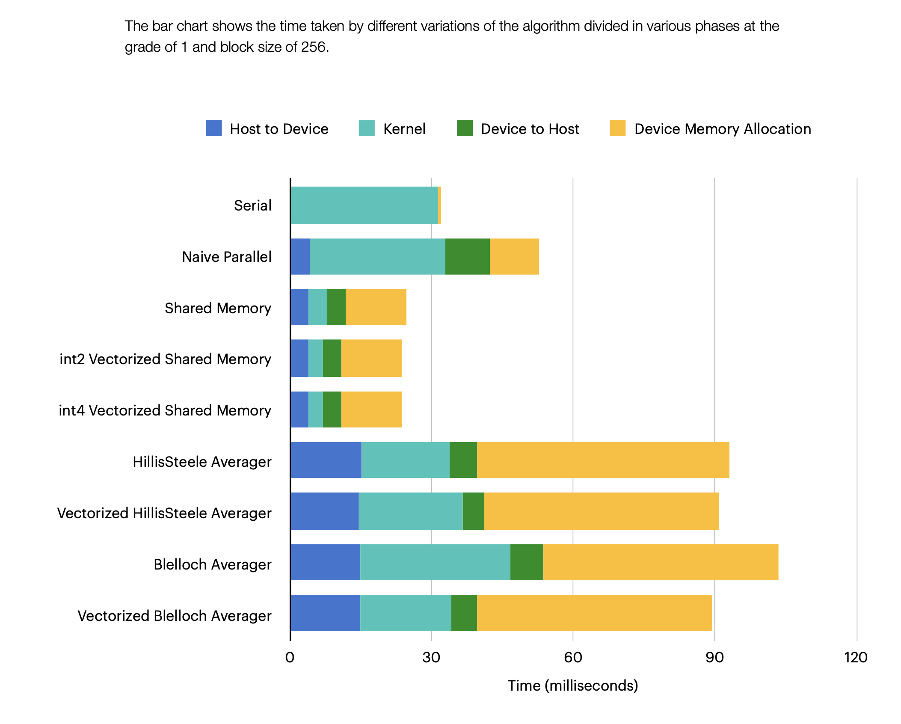

# High-Performance DSP Optimization on NVIDIA Jetson Nano

**Project:** Accelerated Moving Averager & Signal Processing Kernels
**Platform:** NVIDIA Jetson Nano (Maxwell Arch, 128 CUDA Cores, 4GB RAM)
**Result:** **34x Speedup** vs. Single-Threaded CPU Baseline

## Project Overview
This project investigates the performance limits of Digital Signal Processing (DSP) algorithms on edge hardware. The primary goal was to optimize a strongly serial moving average filter. 

By profiling the workload with **Nsight Systems**, I identified that the bottleneck shifted based on the window size (kernel radius):
* **Small Windows:** Bottlenecked by global memory latency. Solved using vectorized loads (`float4`).
* **Large Windows:** Compute-bound. Solved using a parallel prefix sum (Hillis Steele scan) to reduce algorithmic complexity from O(n*k) to O(n).

## Benchmark Results
Performance comparison of different variations of the algorithm at low grade (memory-bound):



## Technical Implementation
* **Memory Coalescing:** Aligned memory access patterns to minimize transactions.
* **Shared Memory Tiling:** Pre-loaded signal data into shared memory to reduce global memory bandwidth pressure.
* **Bank Conflict Avoidance:** padded shared memory arrays to prevent bank serialization.

## 📂 Repository Structure
* `basics/`: CUDA kernels and python script.
* `logs/`: Profiling data and performance metrics.

## 💻 Build & Run
Prerequisites: `nvcc` (CUDA Toolkit 10.2+), C++17.

```bash
# Compile for Jetson Nano (Maxwell architecture sm_53)

nvcc -O3 profilable_moving_averager.cpp -o bin_cpu
nvcc -O3 profilable_parallel_averager.cu -o bin_parallel
nvcc -O3 profilable_sm_averager.cu -o bin_shared
nvcc -O3 profilable_sm_vload2.cu -o bin_vec2
nvcc -O3 profilable_sm_vload4.cu -o bin_vec4
nvcc -O3 hillis_steele_averager.cu -o bin_hillis
nvcc -O3 hillis_steele_vloaded_averager.cu -o bin_vhillis
nvcc -O3 blelloch_scan_averager.cu -o bin_blelloch
nvcc -O3 blelloch_scan_vloaded_averager.cu -o bin_vblelloch

# Run benchmark
python3 run_benchmarks.py